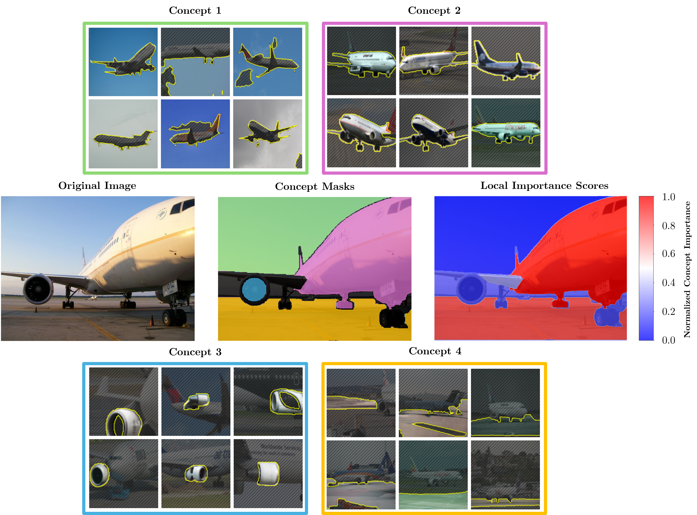

# Towards Human-Understandable Multi-Dimensional Concept Discovery (HU-MCD)

This repository contains the PyTorch implementation for the paper "Towards Human-Understandable Multi-Dimensional Concept Discovery (HU-MCD)". 

HU-MCD automatically extracts human-understandable concepts from pre-trained Convolutional Neural Networks (CNNs). Using these concepts, HU-MCD enables to explain the predictions of CNNs both locally and globally and includes a completeness relation that quantifies to what extend the concepts are sufficient in explaining the CNNs decision.   

The following illustration showcases an example explanations given an image for which the a ResNet50 model pretrained on ImageNet predicts the class `airliner`. Locally, each region within the image can be associated with a concept which can be attributed a local relevance score, highlighting its contribution to the final model prediction. Additionally, locally discovered concept can be associated with global concept candidates to further enhance interpretability. 



## Getting Started

### Install Requirements

#### General Requirements
Create a new python environent (here shown with `virtualenv` but you might also use `anaconda`, `pyenv`, ...)

```shell
# create new virtual environment
$ python3.9 -m venv <env_name>
# activate environment
$ source <env_name>/bin/activate
# install packages in requirements.txt
$ pip install -r requirements.txt
```

#### PyTorch

Note that you should **install PyTorch sperately** depending on whether you have a GPU available or not (see for https://pytorch.org/get-started/locally/). It is recommended to use a GPU.

#### Segment Anything

Additionally, you are required to **install the Segment Anything** libary using their [GitHub repository](https://github.com/facebookresearch/segment-anything?tab=readme-ov-file#model-checkpoints). There, you can also download the [model checkpoint](https://dl.fbaipublicfiles.com/segment_anything/sam_vit_h_4b8939.pth) for the *ViT-H SAM Model* and place it within the main folder of the repository.

### Downloading images

Before running the code, you are required to download images for the classes which you wish to explain:

1. Create a folder called "*sourceDir*" within the main folder of this repository (you might also name the folder differently and pass this name as argument to the python script *-- source_dir [some name]*). 

2. For each class, create a folder within "*sourceDir*" named **exactly** like the classes. For each class at least 400 images should be available (you might also use a different number of class images using the argument *--n_cls_imgs [some number]*)

3. To represent concepts using prototypical images, additional create a folder named "*val_imgs*" within "*sourceDir*" that contains for each class a folder named "*[class name]_val*" containing validation images which where not used for training the explainer

3. If you additionally want to run ACE for comparison, create a folder called "*random*" within "*sourceDir*" that contains random images of different classes (which are used as negative examples to train the Concept Activation Vectors)

For example, if you want to explain the class *airliner* for the ImageNet1k dataset, your folder *"sourceDir*" should look as follows:

```
hu-mcd
├───sourceDir
│   ├──airliner
│   │   ├─airliner_img_01.png
│   │   ├─airliner_img_02.png
│   │   └─...
│   │
│   ├──val_imgs
│   │   └─airliner_val
│   │       ├─airliner_val_img_01.png
│   │       ├─airliner_val_img_02.png
│   │       └─...
│   │
│   └──random
│       ├─rdm_img_01.png
│       ├─rdm_img_02.png
│       └─...
```

#### Downloading training images

At the time of publishing the paper, there is no (reliable) tool available to download only images for certain classes of the Imagenet1k dataset. Thus, you are required to download the entire [dataset](https://image-net.org/challenges/LSVRC/2012/2012-downloads.php) (requires you to register and request access).

#### Downloading validation images

You additional need to have the validation images of the classes you want to explain. These can be downloaded from two sources:

- [Official ImageNet Website](https://image-net.org/challenges/LSVRC/2012/2012-downloads.php): Select 'Validation images (all tasks)' which should have the size 6.3GB.
- [Kaggle](https://www.kaggle.com/datasets/titericz/imagenet1k-val?resource=download): Instructions are provided on their website.

### Enable Layer Masking

To enable Input Masking for the ResNet architecture (loaded using the *timm* libary), replace `timm/models/resnet.py` with `input_masking/resnet.py` (in the libary files). Also, place `input_masking/sal_layers.py` in `timm/models`. To enable Input Masking for other model architectures refer to the [original implementation](https://github.com/SriramB-98/layer_masking/tree/main) of the [Input Masking procedure](https://arxiv.org/pdf/2211.14646.pdf).

## Generating Concepts

### HU-MCD

The code to generate HU-MCD concepts can be excuted by running the following command.

```sh
$ python run_humcd.py
```

This will generate concept explanations of a ResNet50 model for 10 *ImageNet1k* classes using the activation after Global Average Pooling (GAP) of the final convolutional layer. The generated concepts will be saved within the folder `concept_examples/humcd/`. Different settings can be tested by modifying the script arguments.

### MCD

For comparison, this repository also offers the possability to run [Multi-Dimensional Concept Discovery (MCD)](https://arxiv.org/pdf/2301.11911.pdf) framework based on their [publically available implementation](https://github.com/jvielhaben/MCD-XAI/tree/main).

```sh
$ python run_mcd.py
```

### ACE

For comparison, this repository also offers the possability to run [Multi-Dimensional Concept Discovery (MCD)](https://arxiv.org/pdf/2301.11911.pdf) framework based on their [publically available implementation](https://github.com/jvielhaben/MCD-XAI/tree/main).

```sh
$ python run_ace.py
```

## Benchmarking

To calculate the Concept Insertion (C-Insertion) and Concept Deletion (C-Deletion) benchmarks for the three methods (HU-MCD, MCD, ACE), run the following command:

```sh
$ python benchmark_methods.py
```

Note that this requires you to have generated concepts for all three methods as described above.

## License

This project is licensed under the MIT License – see the [LICENSE](./LICENSE) file for details.


